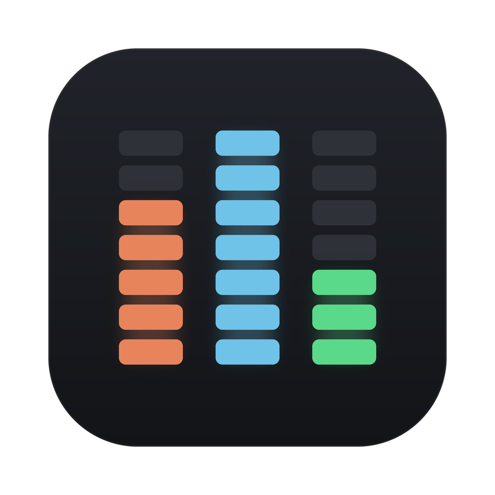

<p align="center">
  
</p>

<h1 align="center">AgentMenu</h1>

A macOS menu bar app that tells you what your AI coding agents are doing — and when one is waiting on you.

If you run **Claude Code**, **Codex**, and **opencode** across several terminals, VS Code windows and apps, you lose track of which one is working, which one finished ten minutes ago, and which one has been sitting on a permission prompt you never saw. AgentMenu puts all of it in one place.

```text
Today  $4.82          last 5h  2.4M tok                        ⚙
────────────────────────────────────────────────────────────────
CLAUDE CODE
┃ ●  ezeeabanotes  ⌥ business-insightaba      NEEDS PERMISSION
┃    Bash  rm -rf target/                                   12s
┃    ▰▰▰▰▰▰▰▱▱▱▱▱▱▱  47%    99.7k tok    $3.10        4m12s

CODEX
┃ ◐  worldmonitor                                      WORKING
┃    exec  npm run typecheck                              1m14s
┃    ▰▰▰▰▰▰▰▰▰▰▱▱▱▱  73%     188k tok    $1.44       12m03s

OPENCODE
┃ ○  lucid-ui                                              DONE
┃    "Both files are in your Java projects folder…"          4m
┃    ▰▰░░░░░░░░░░░░  11%    51.5k tok    $0.45        8m41s
```

Click a row to jump to the window that agent lives in. The menu bar icon badges red the moment something needs you.

---

## Install

Download `AgentMenu-1.0.0.dmg` from [Releases](https://github.com/nisarganag/AgentMenu/releases), open it, and drag **AgentMenu.app** to Applications.

### macOS will block the first launch — here's how to get past it

AgentMenu is **ad-hoc signed, not notarised** (notarisation requires a paid Apple Developer ID). macOS will refuse to open it the first time with:

> *"AgentMenu.app" cannot be opened because the developer cannot be verified.*

This is expected and only happens once. Pick whichever works on your macOS version:

**Method 1 — System Settings (most reliable on macOS 15 and later)**

1. Double-click **AgentMenu.app** once and dismiss the warning.
2. Open **System Settings → Privacy & Security**.
3. Scroll down — you'll see *"AgentMenu.app was blocked to protect your Mac."*
4. Click **Open Anyway**, then confirm with Touch ID or your password.

**Method 2 — right-click (works on macOS 14, sometimes later)**

Right-click (or Control-click) **AgentMenu.app** → **Open** → **Open** in the dialog.

> Note: plain double-clicking will *not* work, and neither will opening it from Launchpad. The right-click path is what tells Gatekeeper you meant it.

**Method 3 — Terminal (if neither of the above appears)**

macOS attaches a quarantine flag to anything downloaded from the internet. Removing it clears the block:

```bash
xattr -d com.apple.quarantine /Applications/AgentMenu.app
```

If that reports *"No such xattr"*, the flag is already gone and the block is something else — open an issue.

### After it opens

There's **no Dock icon and no window** — that's intentional. Look for the pulse glyph in your menu bar, top right.

Click it → **Preferences** to turn on *Start at login* and install the permission-detection hooks.

> **Start at login requires the app to live in `/Applications`.** `SMAppService` registration fails from anywhere else.

Requires macOS 14 or later. Universal binary — Apple Silicon and Intel.

---

## What it shows

| | Claude Code | Codex | opencode |
| --- | --- | --- | --- |
| Current activity | ✅ | ✅ | ✅ |
| Session finished | ✅ | ✅ | ✅ |
| **Blocked on permission** | ✅ **exact** | ⚠️ **inferred** | ✅ **exact** |
| Context window % | ✅ | ✅ | ✅ *(if model is priced)* |
| Token totals | ✅ | ✅ | ✅ |
| Cost | computed | computed | **native** |

**About that ⚠️.** Codex does not record approval requests anywhere on disk, and its `notify` mechanism has no approval event. There is no way to know for certain that Codex is blocked. So AgentMenu infers it from a stalled turn and *renders it differently* — a hollow amber ring and the words `MAYBE WAITING`, never the solid red `NEEDS PERMISSION` a confirmed block gets. The menu bar badge makes the same distinction. A monitor that presents a guess as a fact is worse than no monitor.

---

## How permission detection works

Two channels feed the app.

**Pull** — it tails Claude Code's and Codex's JSONL transcripts and reads opencode's SQLite database. This is where the numbers come from: tokens, cost, context fill, current activity.

**Push** — for instant, accurate permission alerts, AgentMenu installs hooks into the agents' own configs:

- `~/.claude/settings.json` gains `Notification` and `Stop` hook entries
- `~/.codex/config.toml`'s `notify` is pointed at a shim that **forwards to whatever was there before**, so an existing integration keeps working unchanged

Both are opt-in from Preferences and fully reversible. Before either file is touched a timestamped backup is written, and uninstall removes exactly what was added — every entry AgentMenu writes carries an `_agentmenu` tag. The Codex shim stores your original `notify` line base64-encoded inside itself so uninstall restores it byte-for-byte.

The installer will **refuse rather than risk your config** if it meets something it can't safely round-trip (a multi-line `notify` array, for instance). Not getting permission alerts is an acceptable outcome; a Codex that won't start is not.

Push is authoritative for *state*, pull for *numbers*. If a "permission resolved" event is ever missed, file evidence takes over after five seconds — so a red dot can't get stuck forever.

---

## What it deliberately does not show

- **Rate-limit or quota percentages.** Neither Claude Code nor Codex persists quota state to disk (`rateLimits` is `null` in every transcript). Any "62% of your weekly limit" would be invented. Instead you get *absolute* rolling burn — tokens in the last 5 hours — computed exactly. Set your own budget in Preferences and a percentage appears against *that*.
- **Costs for models it doesn't know.** An unpriced model shows `—`, never `$0.00`. Prices live in a user-editable `pricing.json` inside the app bundle; add a model and the cost appears.
- **Context meters without a known window.** No window, no bar — rather than a bar against a guessed size.

The rule throughout: an unknown number renders as absent, never as a plausible-looking lie.

---

## Build from source

Full Xcode is not required — Command Line Tools are enough.

```bash
git clone https://github.com/nisarganag/AgentMenu.git
cd AgentMenu
swift test          # 130 tests
make bundle         # dist/AgentMenu.app
make dmg            # dist/AgentMenu-1.0.0.dmg
make install        # copy to /Applications
```

`make bundle` builds a universal binary and hand-assembles the `.app` (SwiftPM can't produce bundles), then ad-hoc signs it so notification and accessibility permissions attach to a stable identity.

### Architecture

```text
AgentMenuCore     model, three parsers, session store, hook installer
                  — no AppKit or SwiftUI; this is the tested layer
AgentMenuUI       SwiftUI popover, status item, notifier
AgentMenuApp      lifecycle: App Nap defeat, wake rescan, checkpointing
```

Each agent sits behind one `AgentSource` protocol, so the UI never learns that JSONL or SQLite exist. Adding a fourth agent means writing one parser, not touching the interface.

Resource behaviour is bounded deliberately: only transcripts modified in the last 7 days are read, files are skipped when both mtime and size are unchanged, and caches are evicted as files fall out of the window.

---

## Known limitations

- **Ad-hoc signed, not notarised** — hence the one-time Gatekeeper bypass.
- **Codex permission state is inferred**, as described above.
- **Claude's `permission_prompt` hook subtype is unproven.** The `Notification` hook was verified end-to-end against a live agent, but that specific subtype never fired during testing. The idle subtype did, and maps correctly.
- **opencode context meters need a priced model.** Windows ship for `deepseek-v4-pro` and `kimi-k3`; others show no bar until added to `pricing.json`.
- **Codex cost is an estimate.** OpenAI applies service-tier and long-context multipliers that a flat rate table can't model.
- Roughly **180 MB RSS** and **~3% CPU** while agents are active, most of it a one-time parse of your transcript history at launch.

---

## License

MIT
